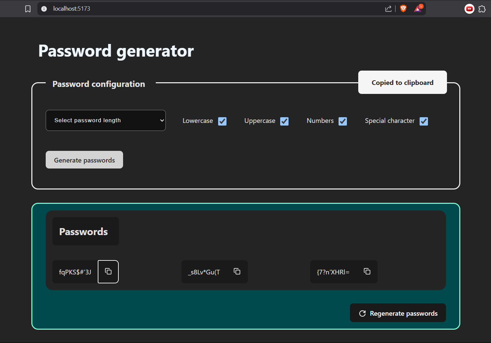
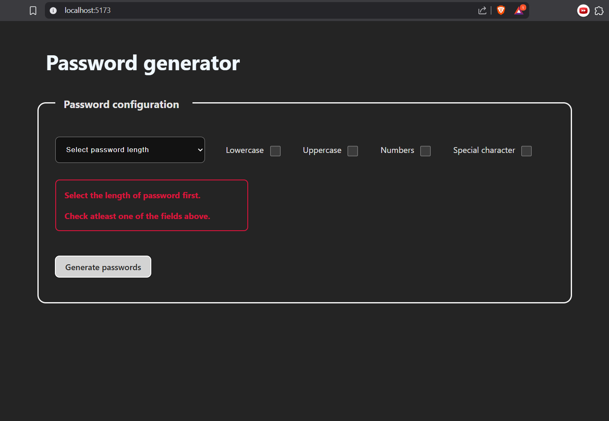

# 🔐 Password Generator

A simple and interactive password generator built with **React**. Users can configure password length and select character types (lowercase, uppercase, numbers, special characters). The app then generates three strong passwords based on the selected configuration, with features to copy and regenerate passwords.

## ✨ Features

- Generate **3 strong passwords** based on custom configurations
- Choose:
  - Password length (8–14)
  - Lowercase letters
  - Uppercase letters
  - Numbers
  - Special characters
- Copy to clipboard with feedback
- Regenerate passwords with a single click
- Basic input validation and error messages

## Screenshots

- Error handling


## 📦 Technologies Used

- **React** (with Hooks: `useState`, `useEffect`)
- CSS for styling
- `react-icons` for icons (`LuCopy`, `TbRotateClockwise`)


## 🚀 Getting Started

### Prerequisites

- Node.js and npm installed on your machine

### Installation

```bash
git clone https://github.com/i-am-rut/password-generator.git
cd password-generator
npm install
npm start


