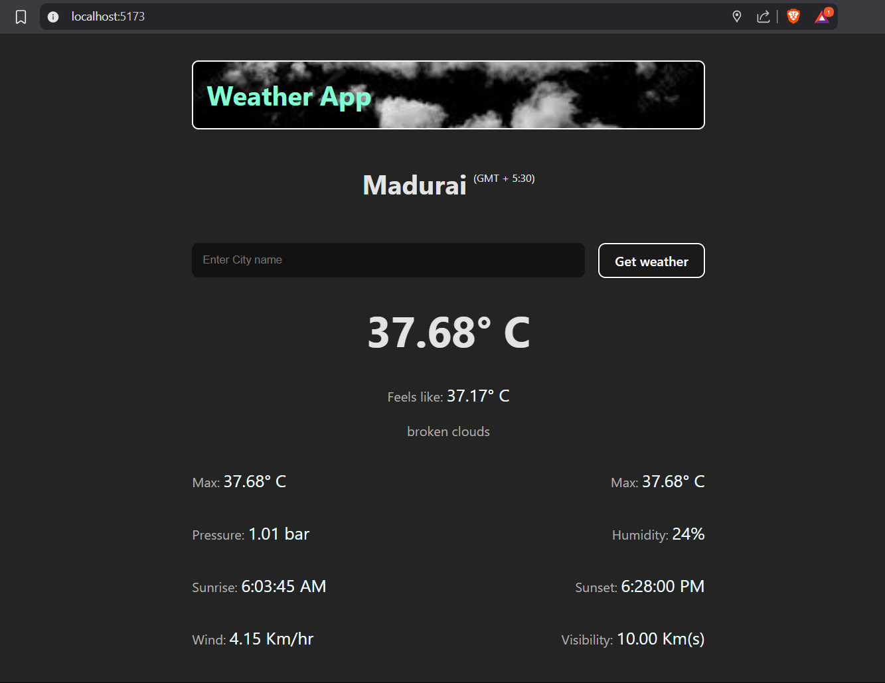

# 🌦️ Weather App

A simple React weather app that uses the **OpenWeatherMap API** and the **browser's geolocation API** to show real-time weather information for your current location or any city you search.

---

## Features

- 🌍 Get weather by **current location** (via browser GPS)
- 🏙️ Search weather by **city name**
- 📊 Shows temperature, feels like, humidity, pressure, wind speed, visibility, and more
- 🌅 Shows **sunrise & sunset** times
- 🌐 Displays **timezone offset**
- 🧭 Loading indicator while fetching data
- 🔧 Handles geolocation errors gracefully

---

## Tech Stack

- React (Vite)
- OpenWeatherMap API
- HTML5 Geolocation API
- CSS for basic styling

---

## Screenshot



---

## Setup

1. **Clone the repo**
   ```bash
   git clone https://github.com/i-am-rut/weather-app.git
   cd weather-app
